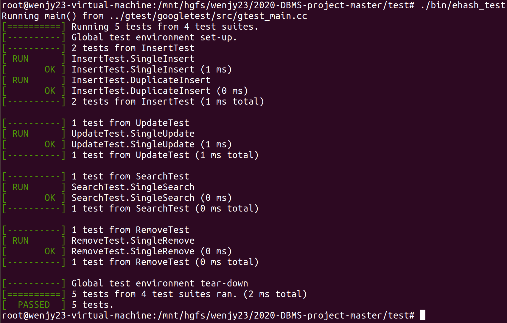
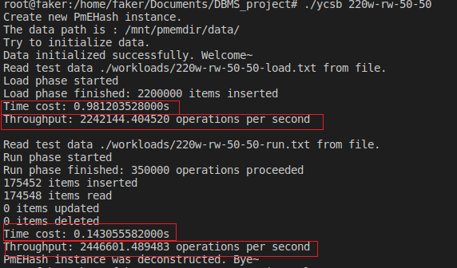

# 2020-DBMS-project

**小组成员**

| 学号 | 姓名 |
| :-------:| :---:|
| 18308008 | 车春江|
| 18353070 | 谭嘉伟|
| 17364025 | 贺恩泽|
| 18324061 | 文君逸|

## 成员分工

* 车春江：页表结构的设计和实现，可扩展哈希类的构造和析构方法的设计和实现，以及从持久化文件中载入数据、恢复数据库的操作和设置数据页和文件的映射关系，以及利用 NVM 实现文件的映射、反映射和持久化等操作，部分实验报告。
* 谭嘉伟：可扩展哈希中的增、删、查、改操作的设计和实现，以及哈希函数的设计，实现桶的分裂和合并操作、目录的倍增操作，对其余模块代码的代码调整与优化，对数据库的性能进行调优及相应实验报告，并使用ycsb进行对拍测试，验证其正确性，以及编写命令行数据库CLDB
* 贺恩泽：对整个项目进行调试，Makefile、测试数据生成器和ycsb对拍及单点计时功能的编写，测试数据集以及gtest测试的调试工作，以及参与到页表和可扩展哈希类的设计和优化，ycsb下不同操作平均时间统计，并尝试实现多线程来对数据库的性能加以优化及相应实验报告
* 文君逸：ycsb测试的整体架构设计，并编写代码实现ycsb，读取测试数据并测试数据库的性能，以及参与到页表和可扩展哈希类的设计和优化，对数据库进行性能调优，完成部分实验报告和项目说明的大部分内容，并对测试方法和步骤进行详细的说明

## 项目内容

&emsp;&emsp;实验项目完成的目标是完成基于针对NVM优化的可扩展哈希的数据结构，实现一个简单的键值存储引擎PmEHash。我们用data_page来实现数据页表的相关操作实现。    

&emsp;&emsp;此项目对外可用的对数据的基本操作如下：

+ **Insert(插入数据)**
+ **Remove(删除数据)**
+ **Update(更新数据)**
+ **Search(查找数据)**
+ **删除所有数据**
+ **重启恢复状态**
  

&emsp;&emsp;我们在数据库课程的学习中认识到，DBMS是一种操纵和管理数据的大型软件。可靠的DBMS应该向用户屏蔽具体数据操作实现细节，并且保证执行事务的原子性、一致性、隔离性、持久性。一般DBMS将大量数据存储在非易失性存储器中，在查询和更新时才将一些数据读入内存缓冲区处理。DBMS需要在数据更新时立即将数据写回非易失性存储器，否则在程序运行崩溃或计算机断电的情况下可能会因为修改的内容没有写回非易失性存储器而丢失，造成数据不一致性与非持久性。

&emsp;&emsp;在本项目中，CPU与NVM交互的方式与内存交互类似。CPU修改NVM中的数据时，也会先在Cache中修改缓存了的数据，DBMS需要将修改及时持久化到NVM中。本项目基于DBMS的上述理念，在每一次数据更新后都立刻将数据持久化写回NVM，以保证实现的整个kv键值对数据库的一致性与持久性。  

&emsp;&emsp;此项目需要完成的任务有：

+ **用内存模拟NVM**
+ **实现代码框架的功能**
+ **进行简单的Google test，运行并通过ehash_test.cpp中的简单测试**
+ **编写main函数进行YCSB benchmark测试，读取workload中的数据文件进行增删改查操作，测试运行时间并截图性能结果。**

## 项目实现方法

&emsp;&emsp;以下我们采用自顶向下的介绍方法，先介绍上层函数是怎么实现的，调用了哪些底层函数，然后再介绍底层函数的实现方法。上层操作指的是kv键值对数据库给外界调用的接口函数(也就是成员函数访问控制为public的几个函数)。底层函数则是实现可扩展hash分裂桶、合并桶等对外界不可见的函数。(也就是成员函数访问控制为private的几个函数)

### Search(查找数据) 和 Update(更新数据)

&emsp;&emsp;查找数据、更新数据是比较简单的操作，只需要根据函数传入的键值，利用自己设计的哈希函数计算出对应的**bucket_id**,再通过**catalog**中的信息得到**bucket_id**对应的桶的虚拟地址，然后遍历这个桶里面所有的槽位就可以了。不同之处是**Update**操作找到对应的**kv**对后需要修改存储的**value**, 并立即进行持久化操作，更新函数实现过程如下：

``` C++
/**
 * @description: 查找目标键值对数据，将返回值放在参数里的引用类型进行返回
 * @param uint64_t: 查询的目标键
 * @param uint64_t&: 查询成功后返回的目标值
 * @return: 0 = search successfully, -1 = fail to search(target data doesn't exist) 
 */
int PmEHash::search(uint64_t key, uint64_t& return_val) {
    int bucketid = hashFunc(key);//先找到这个key所在的桶的地址，然后遍历桶所有的kv对
       
    pm_bucket* tar_bucket = catalog->buckets_virtual_address[bucketid];//取出key对应的桶的虚拟地址

    for (int i = 0; i < BUCKET_SLOT_NUM; i++) {//遍历所有槽位
        if (tar_bucket->bitmap[i] && tar_bucket->slot[i].key == key) {//当前槽位存在键值对 且key与需要检索的key相同
            return_val = tar_bucket->slot[i].value;//取得value值
            return 0;
        }
    }
    
    return -1;
}
/**
 * @description: 更新现存的键值对的值
 * @param kv: 更新的键值对，有原键和新值
 * @return: 0 = update successfully, -1 = fail to update(target data doesn't exist)
 */
int PmEHash::update(kv kv_pair) {
    int bucketid = hashFunc(kv_pair.key);//先找到这个key所在的桶的地址，然后遍历桶所有的kv对
            
    pm_bucket* tar_bucket = catalog->buckets_virtual_address[bucketid];//取出key对应的桶的虚拟地址

    for (int i = 0; i < BUCKET_SLOT_NUM; i++) {//遍历所有槽位
        if (tar_bucket->bitmap[i] && tar_bucket->slot[i].key == kv_pair.key) {//当前槽位存在键值对 且key与需要更新的kv对的key相同
            tar_bucket->slot[i].value=kv_pair.value;//修改
            //修改后需要立即持久化
            pmem_persist(&(tar_bucket->slot[i].value), sizeof(uint64_t));//只需持久化value而不用持久化整个桶 保障运行性能
            return 0;
        }
    }
    
    return -1;
}
```

### Insert(插入数据)

&emsp;&emsp;插入数据的过程包含了查找数据的过程。如果查找到了一个相同键值的数据已经被插入，那么该键值的数据是不允许再次被插入的。而如果在对应的桶中没有找到相同键值的数据，那么就可以开始进行插入过程。一个比较简单的插入过程就是通过调用 **getFreeBucket()** 和调用 **getFreeKvSlot()** 得到插入的地址，将相应的 **bitmap** 位置1即可。但后面我们可以看到，在找到可以插入的地址时并不那么简单，因为一个满的桶可能导致桶的分裂和目录的倍增，也可能导致新的一个页面的分配(getFreeBucket和getFreeKvSlot详见后面的介绍)。同样插入需要持久化操作，函数实现过程如下：

``` C++
/**
 * @description: 插入新的键值对，并将相应位置上的位图置1
 * @param kv: 插入的键值对
 * @return: 0 = insert successfully, -1 = fail to insert(target data with same key exist)
 */
int PmEHash::insert(kv new_kv_pair) {
    uint64_t result;
    if (search(new_kv_pair.key, result) == 0) {//存在相同的key 插入失败
        return -1;
    }

    pm_bucket* new_bucket = getFreeBucket(new_kv_pair.key);//获得一个有空闲槽位的桶来插入

    kv* tar_kv = getFreeKvSlot(new_bucket);//占用一个空闲槽位并获得该槽位的地址

    *tar_kv = new_kv_pair;//插入
    //修改后需要持久化键值对
    pmem_persist(tar_kv, sizeof(kv));
    return 0;
}

/**
 * @description: 获得空闲桶内第一个空闲的位置供键值对插入
 * @param pm_bucket* bucket
 * @return: 空闲键值对位置的虚拟地址
 */
kv* PmEHash::getFreeKvSlot(pm_bucket* bucket) {
    for (int i = 0; i < BUCKET_SLOT_NUM; i++) {//遍历所有槽位
        if (bucket->bitmap[i] == 0) {
            bucket->bitmap[i] = 1;  //分配这个位置
            pmem_persist(bucket->bitmap,sizeof(bucket->bitmap));//将对bitmap的更新持久化
            return &(bucket->slot[i]);
        }
    }

    return NULL;
}
```

### Remove(删除数据)

&emsp;&emsp;删除数据的过程也包含了查找数据的过程，这里不再赘述。同样，删除操作只需要把对应的**bitmap**位置0即可，并需要相应的持久化操作。但是删除数据可能导致一个桶变空，因此可能会触发释放桶的空间，这一操作在后面的函数中会详细说明。删除数据的实现如下：

``` C++
/**
 * @description: 删除具有目标键的键值对数据，不直接将数据置0，而是将相应位图置0即可
 * @param uint64_t: 要删除的目标键值对的键
 * @return: 0 = removing successfully, -1 = fail to remove(target data doesn't exist)
 */
int PmEHash::remove(uint64_t key) {
    int bucketid = hashFunc(key);//先找到这个key所在的桶的地址，然后遍历桶所有的kv对
             
    pm_bucket* tar_bucket=catalog->buckets_virtual_address[bucketid];//获得桶的虚拟地址

    bool succ=0;
    for (int i = 0; i < BUCKET_SLOT_NUM; i++) {//遍历所有槽位
        if (tar_bucket->bitmap[i] && tar_bucket->slot[i].key == key) {//当前槽位有kv对 且kv对的key与希望删除的key相同
            tar_bucket->bitmap[i]=0;//删除
            //修改后需要持久化
            pmem_persist(tar_bucket->bitmap, sizeof(tar_bucket->bitmap));//只需要持久化bitmap而不需要持久化整个桶 保障程序运行性能
            succ=1;//删除成功
            break;
        }
    }   

    if (isBucketFull(bucketid)) mergeBucket(bucketid);//桶空了后 看是否需要合并桶 回收空间

    if (succ) return 0;else return -1;
}

/**
 * @description: 判断桶是否为空
 * @param int: 桶号
 * @return bool: 1桶为空/0桶不为空 
 */
bool PmEHash::isBucketFull(int bucket_id){
    pm_bucket* tar_bucket=catalog->buckets_virtual_address[bucket_id];

    for (int i = 0; i < BUCKET_SLOT_NUM; i++) {//遍历所有槽位
        if (tar_bucket->bitmap[i])
            return 0;
    }
    return 1;
}
```

### 哈希函数

&emsp;&emsp;讨论完了上面的上层接口，现在来讨论一下底层的哈希函数。哈希函数的设计对于哈希表来说非常重要，对可扩展哈希也是如此。如果可扩展哈希的哈希函数选择的不好，那么正如助教师兄提供的课本所说，在一定的偏斜的数据输入的情况下，会导致哈希表运行效率恶化，甚至导致程序崩溃。具体来说，假设我们设计的`BUCKET_SLOT_NUM`是默认的15，而`global_depth`初始为4，我们的hash函数设计为直接取key二进制的最低`global_depth`位，我们考虑用户以下情况的输入。

&emsp;&emsp;假设数据初始为空，用户接着连续插入16个kv对：用户输入的key最低60位都为0，只有最高4位从0000取到1111各不相同(共16个不同的key)。这16个key显然都会被分到相同的0号桶。插入前15个kv对之后，由于`BUCKET_SLOT_NUM`刚好为15，那么此时0号桶容纳的下15个kv对，不会发生问题。接着插入第16个kv对，这个kv对会被分到0号桶，可是0号桶已经容纳不下了，也就会触发0号桶的分裂。

&emsp;&emsp;0号桶分裂1次，局部深度就会增加1。局部深度超过全局深度后，会导致全局深度也增加1，进而触发目录倍增。由于hash函数设计地比较简单，直接取key二进制的最低`global_depth`位作为桶号。0号桶需要持续地分裂，直到0号桶存在两个key二进制从低到高第`local_depth`位不同，才能将0号桶内之前的元素分到两个桶中，也才有新的槽位给第16个kv对插入。

&emsp;&emsp;然而，这16个kv对的二进制最低60位都完全相同。那么`local_depth`要增加到61，才能将0号桶中的元素分到两个桶中。由于`global_depth`大于等于所有`local_depth`，此时会导致`global_depth`也增加到61。那么也就意味着，目录项要倍增到$2^{61}$项。目录项中一个`pm_address`信息就需要8字节的空间才能记录(还未考虑`pm_bucket`的空间)。那么单是`pm_address`，就需要总共$2^{64} Byte$的空间。换算一下就是需要$2^{24} TB$(33,554,432‬ TB)。这个数字显然是个天文数字，远远超过了内存和磁盘能容纳的空间大小。程序还未运行到这个时候就会立即崩溃。

&emsp;&emsp;因此，如果哈希函数设计得不好，仅仅插入16个kv对，就可以让可扩展哈希完全崩溃。

&emsp;&emsp;为了克服上面所说的困难，我们对于给定的key，先将这个key进行一些比较复杂的取模、移位、异或的处理(根据相关组合数学与数论知识，对大质数取模效果更好)。使得对于用户输入的key，可以通过hash函数比较均匀地映射到另一个64位无符号整数空间
。我们再将新得到的无符号整数取二进制最低`global_depth`位得到桶号。之所以取二进制低位，是因为这个操作可以很方便地通过速度较快的位运算&(catalog_size-1)得到。(同时，取二进制低位也使得目录倍增更为方便，详见对目录倍增的分析)

``` C++
/**
 * @description: 用于对输入的键产生哈希值，然后取模求桶号(自己挑选合适的哈希函数处理)
 * @param uint64_t: 输入的键
 * @return: 返回键所属的桶在目录中的编号
 */
int PmEHash::hashFunc(uint64_t key) {
    
    key=(((key<<44)|(key>>20))%998244353+key)^((key<<24)|(key>>40))^(((key<<32)|(key>>32))%1000000009*key);//足够复杂的hash函数使得偏斜的key输入映射得到的hash函数值更均匀
    //hash函数设计不当会导致偏斜数据输入导致全局深度迅速增加 使得内存完全被占用导致程序崩溃

    return key&(metadata->catalog_size-1);//返回桶号    
}
```

### 插入时获得有空闲槽位的桶

&emsp;&emsp;插入时需要找到一个有空闲槽位的，key可以插入的桶。getFreeBucket实现了这个功能。其通过hash函数得到key分到的桶号，如果桶是空的就返回桶的虚拟地址，否则将当前桶分裂。

&emsp;&emsp;注意到单纯一次分裂可能不能将旧桶中的元素完全分开(局部深度增加没有改变旧桶中所有元素被分到的桶号)，可能会有连续分裂的情况，详见代码注释。

```C++
/**
 * @description: 获得供插入的空闲的桶，无空闲桶则先分裂桶然后再返回空闲的桶(可能会触发连续分裂)
 * @param uint64_t: 带插入的键
 * @return: 空闲桶的虚拟地址
 */
pm_bucket* PmEHash::getFreeBucket(uint64_t key) {

    while (1){//对连续分裂的处理
        int bucketid = hashFunc(key);
        pm_bucket* insert_bucket=catalog->buckets_virtual_address[bucketid];//获得虚拟地址
       
        if (haveFreeKvSlot(insert_bucket))//直到对当前插入的元素分到的桶有空闲槽位时返回
            return insert_bucket;

        splitBucket(bucketid);//否则连续分裂桶
    }
}

/**
 * @description: 判断桶内是否存在空闲位置
 * @param: pm_bucket* bucket
 * @return bool: 存在/不存在空闲KvSlot 
 */
bool PmEHash::haveFreeKvSlot(pm_bucket* bucket) {
    for (int i = 0; i < BUCKET_SLOT_NUM; i++) {//遍历所有槽位
        if (bucket->bitmap[i] == 0) return true;//存在空闲槽位
    }

    return false;
}
```

### 分裂桶的处理

&emsp;&emsp;一个桶在被判断满后需要分裂，我们先得到要分裂的桶的虚拟地址。一个桶分裂后，其对应的局部深度要加一，即放入这个桶的元素的二进制位需要多判断一位。

&emsp;&emsp;分裂一个桶无非是要用一个新的二进制位的0和1来区分原来的局部深度所不足以区分的键值。所以分裂过程中我们只需要将待分裂的桶的新的这一个二进制位所能区分的数据分装到分裂后的两个桶里即可。区分的过程采用位运算即可，直接使用位运算可以加快程序运行速度。     

&emsp;&emsp;上面原理性操作结束后，需要持久化更改。之后处理好目录指向新、旧桶的指针(也是通过二进制下新用来判断的二进制位来区分)，并进行目录项的持久化操作即可，详见下面代码的注释。    

&emsp;&emsp;此外，需要注意到如果桶原来的局部深度等于全局深度，说明用全局深度个二进制位来分桶是不够的，需要让全局深度增加1和倍增目录。另外，分裂桶需要申请一个新的空闲的桶，申请新桶的空间由函数`getFreeSlot`实现。

``` C++

/**
 * @description: 桶满后进行分裂操作，可能触发目录的倍增
 * @param uint64_t: 目标桶在目录中的序号
 * @return: 无返回值
 */
void PmEHash::splitBucket(uint64_t bucket_id) {

    pm_bucket* sp_Bucket=catalog->buckets_virtual_address[bucket_id];//得到被分裂的桶虚拟地址

    if (sp_Bucket->local_depth==metadata->global_depth) extendCatalog();//局部深度等于全局深度 需要倍增目录

    pm_address new_address;
    pm_bucket* new_Bucket=(pm_bucket*)getFreeSlot(new_address);//得到新的桶虚拟地址

    int old_local_depth=sp_Bucket->local_depth;//记录旧的深度用于之后将旧桶中的元素分裂到新桶
    new_Bucket->local_depth=++sp_Bucket->local_depth;//更新桶的深度
    pmem_persist(&(sp_Bucket->local_depth), sizeof(sp_Bucket->local_depth));//持久化桶的深度
    pmem_persist(&(new_Bucket->local_depth), sizeof(new_Bucket->local_depth));
   
    int cur=0;
    for(int i=0;i<BUCKET_SLOT_NUM;i++) if (hashFunc(sp_Bucket->slot[i].key)&(1<<old_local_depth)){//旧桶中的元素应该被hash函数分到新桶中
        sp_Bucket->bitmap[i]=0;//从旧桶中删去
        new_Bucket->bitmap[cur]=1;//插入新桶
        new_Bucket->slot[cur].key=sp_Bucket->slot[i].key;
        new_Bucket->slot[cur].value=sp_Bucket->slot[i].value;
        pmem_persist(&(new_Bucket->slot[cur]),sizeof(kv));//将桶中的键值对持久化
        cur++;
    }

    //修改后需要持久化sp_Bucket和new_Bucket的bitmap。直接将两个桶持久化的复杂度较高
    pmem_persist(sp_Bucket->bitmap, sizeof(sp_Bucket->bitmap));
    pmem_persist(new_Bucket->bitmap, sizeof(new_Bucket->bitmap));

    for(int i=(bucket_id&((1<<old_local_depth)-1))|(1<<old_local_depth);i<metadata->catalog_size;i+=(1<<(old_local_depth+1))){//更新目录项，一半指向旧桶的目录项指向新桶
        catalog->buckets_pm_address[i]= new_address;
        catalog->buckets_virtual_address[i]=new_Bucket;
        pmem_persist(&(catalog->buckets_pm_address[i]), sizeof(pm_address));
    }

}

/**
 * @description: 获得一个可用的数据页的新槽位供哈希桶使用，如果没有则先申请新的数据页
 * @param pm_address&: 新槽位的持久化文件地址，作为引用参数返回
 * @return: 新槽位的虚拟地址
 **/
void* PmEHash::getFreeSlot(pm_address& new_address) {  
    if(free_list.empty()) allocNewPage();//free_list不存在空闲的桶 需要分配一个新页
    
    pm_bucket* new_bucket = free_list.front();//取出一个空闲的桶
    free_list.pop();

    new_address=vAddr2pmAddr[new_bucket];//得到对应的桶所在的实际地址

    data_page* bucket_data_page=data_page_list[new_address.fileId-1];
    bucket_data_page->bit_map[new_address.offset/sizeof(pm_bucket)]=1;//占用标记
    pmem_persist(bucket_data_page->bit_map,sizeof(bucket_data_page->bit_map));//持久化占用标记

    return new_bucket;//返回虚拟地址
}
```

### 目录倍增

&emsp;&emsp;如果分裂的桶的局部深度(在分裂前)等于全局深度，说明当前哈希函数使用key哈希处理后的二进制的最低`global_depth`位不够用来分桶。需要让哈希函数分桶考虑的最低二进制位数目增加一位(`global_depth`需要增加1)。全局深度增加后，同时需要目录倍增，并对新增加的目录项赋予合适的对应的桶地址的值。由于哈希函数设计为取key哈希处理后的最低若干个二进制位作为桶号，而且目录第i项对应的就是i号桶的地址信息。因此，只需要将原来旧的数组很方便地复制一份接到其后面，就可以实现全局深度加1后导致的目录倍增。这个过程可能需要临时的动态内存空间，详见下面的代码注释。

```C++
/**
 * @description: 对目录进行倍增，需要重新生成新的目录文件并复制旧值，然后删除旧的目录文件
 * @param NULL
 * @return: NULL
 */
void PmEHash::extendCatalog() {

    pm_address* old_pm_address=new pm_address[metadata->catalog_size];
    pm_bucket** old_pm_bucket=new pm_bucket*[metadata->catalog_size];
    
    memcpy(old_pm_address, catalog->buckets_pm_address, sizeof(pm_address)<<metadata->global_depth);//复制旧的目录到临时数组
    memcpy(old_pm_bucket, catalog->buckets_virtual_address, sizeof(pm_bucket*)<<metadata->global_depth);

    metadata->global_depth++;//更新全局深度和目录大小
    metadata->catalog_size<<=1;
    pmem_persist(metadata,sizeof(ehash_metadata));//持久化元数据

    std::string name = Env::get_path() + std::string("catalog");//重新映射一个更大的目录文件(用于存放buckets_pm_address)
    int is_pmem;
    size_t pm_address_len;
    catalog->buckets_pm_address = (pm_address*)pmem_map_file(name.c_str(), sizeof(pm_address)<<metadata->global_depth, PMEM_FILE_CREATE, 0666, &pm_address_len, &is_pmem);
    
    catalog->buckets_virtual_address=new pm_bucket*[metadata->catalog_size];//申请一个更大的存放buckets_virtual_address的数组

    memcpy(catalog->buckets_pm_address, old_pm_address, sizeof(pm_address)<<(metadata->global_depth-1));//将临时数组拷贝到新的存放目录项的数组 新数组前一半和后一半都拷贝一份旧数组 
    memcpy(catalog->buckets_pm_address+(1<<(metadata->global_depth-1)), old_pm_address, sizeof(pm_address)<<(metadata->global_depth-1));
    memcpy(catalog->buckets_virtual_address, old_pm_bucket, sizeof(pm_bucket*)<<(metadata->global_depth-1));
    memcpy(catalog->buckets_virtual_address+(1<<(metadata->global_depth-1)), old_pm_bucket, sizeof(pm_bucket*)<<(metadata->global_depth-1));

    delete [] old_pm_address;//释放临时数组的空间
    delete [] old_pm_bucket;

    //需要持久化目录        
    pmem_persist(catalog->buckets_pm_address, sizeof(pm_address)<<metadata->global_depth);

}
```
### 

### 桶空后的空间回收

&emsp;&emsp;因为助教师兄提供的参考资料上写出回收空桶对于正确性保证来说不是必须的，可以根据数据库的具体需求进行实现。我们小组根据上课所学的知识和参考资料，考虑设计了回收桶的空间这一功能。

&emsp;&emsp;为了方便描述，我们不妨称一个桶中任一键值对的key的哈希处理后的二进制最低`local_depth`位为这个桶的tag。称一个桶tag异或$(1 << local_depth)$得到的tag所对应的桶为对偶桶(tag和桶号的区别是，桶号是由哈希函数得到。目录中多个桶号对应的地址可能是同一个实际的物理桶的地址。一个物理桶则和一个tag一一对应)。显然，一个桶和他的对偶桶由同一个局部深度为`local_depth`-1的桶分裂得到。一个桶和他的对偶桶合并得到的也就是原来这个分裂了的局部深度为`local_depth`-1的桶。

&emsp;&emsp;桶的合并不仅和当前删除键值对的桶有关，还与当前桶对应的对偶桶有关。当前桶对应的对偶桶局部深度和当前桶相同时，才有可能进行合并。否则说明对偶桶已经分裂过形成了多个桶，这个时候不能将当前桶合并。

&emsp;&emsp;在当前桶和对偶桶的局部深度相同的情况下，可以进行两个桶的合并。桶的合并方法至少包括以下三种：1、一个桶和他的对偶桶的所有键值对刚好能够塞入一个桶时，合并该桶和对偶桶；2、一个桶为空时，合并该桶和对偶桶；一个桶和他的对偶桶都为空时，才合并该桶和对偶桶。

&emsp;&emsp;桶的回收实质上是用时间换空间，也就是需要通过牺牲时间的代价来回收空间。如果希望尽可能回收多余的空间(像上面所述的第一种方法，就需要每删除一个元素后付出额外的时间检查当前桶和对偶桶的元素数目)，那么势必需要投入很多时间开销，会影响到数据库的性能，这也是一些参考资料上不使用这种方法的原因。

&emsp;&emsp;对于目录而言，如果每个目录元素与它的分裂映像都指向同一个桶，还可以对目录进行减半，从而减小全局深度，尽管这对于代码的正确性也不是必要的，而且恰好恢复到每个目录元素与它的分裂映像都指向同一个桶的情况出现的比较少。除非是在目录倍增后的临界情况下，但如果设计了这个操作，可能会导致临界状态下来回倍增与回收目录空间的巨大时间开销。

&emsp;&emsp;桶的合并也是如此。如果采用上面第二种合并方法，一个删除键值对后的空桶的对偶桶中还存在元素，那么合并后的新桶也依然会比较容易分裂。假设对偶桶刚好是满的，那么合并后的桶如果再插入一个元素，又会导致分裂。注意到分裂桶和合并桶都要对目录中很多项的相应地址进行修改，在最坏情况下可能要将整个目录大小数量的目录项进行修改。如果合并后新桶处于满的临界状态下，则可能会因为后续的操作反复分裂与合并，使得数据库性能恶化。一个可能更好一点的方法是设计一个装载因子，当一个删除键值对的桶空，且他的对偶桶键值对个数小于等于装载因子时，才进行着两个桶的合并。但这种方法也需要额外统计对偶桶的元素个数，也会加大时间开销。

&emsp;&emsp;基于上述原因，考虑在当前情境下，对于给定的数据集不是很缺少内存空间，且为了后续性能优化考虑。我们并不是每一个桶一旦空就进行合并，而是等到该桶和对偶桶都空了再进行合并。注意到这种情况下如同分裂桶可能会导致连续分裂，此时也可能会导致连续合并。合并成的新的空桶如果对偶桶也为空，那么就会触发再次合并，回收空闲的空间。考虑到数据库用户的键值访问可能也存在局部性，当空桶的对偶桶中有元素的时候，说明可能之后还会再次进行对偶桶的元素插入，避免了合并和额外操作目录项的时间开销。而当桶和对偶桶都空时，说明这两个桶实在元素太少了，且可预见的未来也可能不再会向合并后的桶插入很多元素导致再次分裂。这样的方法既保证了空闲空间的回收，也保证了数据库的运行效率。    

&emsp;&emsp;根据上面的原理，两个空桶合并的时候，原本为了区分新的键值而给这两个空桶分配的新二进制位便不再使用，因此局部深度会减1。我们用**freeEmptyBucket()** 函数来回收桶的空间， 即进行一些细节处理，然后修改对应的虚拟地址和持久内存地址的映射，并进行数据持久化即可。具体实现代码如下：

``` C++
/**
 * @description: 桶空后，回收桶的空间，并设置相应目录项指针(可能会触发连续合并)
 * @param uint64_t: 桶号
 * @return: NULL
 */
/**
 * @description: 桶空后，回收桶的空间，并设置相应目录项指针(可能会触发连续合并)
 * @param uint64_t: 桶号
 * @return: NULL
 */
void PmEHash::mergeBucket(uint64_t bucket_id) {
    pm_bucket* mer_bucket=catalog->buckets_virtual_address[bucket_id];//得到桶的虚拟地址
    if (mer_bucket->local_depth==1) return;//局部深度为1时不能合并
    bucket_id=bucket_id&((1<<mer_bucket->local_depth)-1);//获得当前桶的tag

    while (1){//连续合并的处理
        uint64_t dual_id=bucket_id^(1<<(mer_bucket->local_depth-1)); //通过当前桶tag计算对偶桶的tag
        pm_bucket* dual_bucket=catalog->buckets_virtual_address[dual_id];//对偶桶虚拟地址
        if (dual_bucket->local_depth!=mer_bucket->local_depth) break;//如果两个桶局部深度不相等 不能合并
        if (!isBucketFull(dual_id)) break;//对偶桶不空 
        
        //下面需要合并

        if (bucket_id&(1<<(mer_bucket->local_depth-1))){//合并后的新的桶的tag应该为对偶桶的桶的tag
            swap(bucket_id,dual_id);
            swap(dual_bucket,mer_bucket);
        }
        //使得第local_depth位为0的项为bucket_id  第local_depth位为1的项为dual_id
        
        freeEmptyBucket(catalog->buckets_virtual_address[dual_id]);//归还空间
        mer_bucket->local_depth--;//局部深度--
        
        pmem_persist(&(mer_bucket->local_depth), sizeof(mer_bucket->local_depth));//修改后需要持久化桶

        for(int i=(bucket_id&((1<<mer_bucket->local_depth)-1))|(1<<mer_bucket->local_depth);i<metadata->catalog_size;i+=(1<<(mer_bucket->local_depth+1))){//更新目录项，将指向一个桶的目录项全部改指另一个桶
            catalog->buckets_pm_address[i]=catalog->buckets_pm_address[bucket_id];
            catalog->buckets_virtual_address[i]=catalog->buckets_virtual_address[bucket_id];
            pmem_persist(&(catalog->buckets_pm_address[i]), sizeof(catalog->buckets_pm_address[i]));//修改后需要持久化目录  
        }
        
        if (mer_bucket->local_depth==1) break;//局部深度为1时不能再合并

    }

}

/**./
 * @description: 释放一个空桶的空间
 * @param pm_address: 所释放槽位的虚拟地址
 * @return: 无返回值
 */
void PmEHash::freeEmptyBucket(pm_bucket* bucket){
    free_list.push(bucket);//加入free_list
    pm_address bucket_address=vAddr2pmAddr[bucket];//取得对应的物理地址
    data_page* bucket_data_page=data_page_list[bucket_address.fileId-1];
    bucket_data_page->bit_map[bucket_address.offset/sizeof(pm_bucket)]=0;//占用标记置为0
    pmem_persist(bucket_data_page->bit_map,sizeof(bucket_data_page->bit_map));
}
```

### 定长页表的设计

&emsp;&emsp;定长页表的头文件设计如下：

``` C++
struct data_page{
    // fixed-size record design
    // uncompressed page format
    //一个数据页面要定义页面号， 记录哪些桶可以用，哪些桶不能用的位图，以及存放数据的桶
    //和TA示意图是一样的
    pm_bucket buckets[DATA_PAGE_SLOT_NUM];
    bool bit_map[DATA_PAGE_SLOT_NUM];
    uint32_t page_id;

    data_page(){
        memset(bit_map, 0, sizeof(bit_map));
    }
};
```
&emsp;&emsp;在初始化的过程只要将所有的桶记为可用即可。

### 分配新的一页

&emsp;&emsp;实现这个功能所用的函数为**allocNewPage()**，首先需要在持久化内存上建立新的一页，也就是建立新的文件，然后需要将新建的一页的每一个桶都记为可用，并建立持久内存和虚拟内存之间的对应联系，并将**catalog**的**max_file_id**加1即可。实现代码如下：

``` C++
/**
 * @description: 申请新的数据页文件，并把所有新产生的空闲槽的地址放入free_list等数据结构中
 * @param NULL
 * @return: NULL
 */
void PmEHash::allocNewPage() {
    metadata->max_file_id++;//最大文件号自增1
    pmem_persist(&(metadata->max_file_id),sizeof(metadata->max_file_id));//持久化最大文件号

    data_page* new_page=create_new_page(metadata->max_file_id);//创建一个新页
    data_page_list.push_back(new_page);//放入新页的指针到data_page_list

    pm_address new_address;
    new_address.fileId = metadata->max_file_id;
    for(int i = 0;i < DATA_PAGE_SLOT_NUM;i++){
        free_list.push(&new_page->buckets[i]);//新的物理桶的空间
        new_address.offset = i*sizeof(pm_bucket);//计算对应data_page中的地址

        vAddr2pmAddr[&new_page->buckets[i]] = new_address;//建立持久化内存与映射关系
        // pmAddr2vAddr[new_address] = &new_page->buckets[i];//pmAddr2vAddr在数据库运行时没有用到 处于性能考虑而注释掉
    }
}
/*
 @创建一个新的数据页
 */
data_page* create_new_page(uint32_t id){
    std::string name = Env::get_path() + to_string(id);
    size_t map_len;
    int is_pmem;  
    
    data_page* new_page = (data_page*)pmem_map_file(name.c_str(), sizeof(data_page), PMEM_FILE_CREATE, 0666, &map_len, &is_pmem);//建立到NVM中数据页文件的映射
    new_page->page_id = id;
    memset(new_page->bit_map,0,sizeof(new_page->bit_map));//bit_map清零 for(int i=0;i<DATA_PAGE_SLOT_NUM;i++) new_page->bit_map[i]=0;
    pmem_persist(new_page->bit_map, sizeof(new_page->bit_map));//持久化写回NVM
    return new_page;
}

```

### 重新启动时恢复映射状态

&emsp;&emsp;完成这个过程所采用的主要函数是**recover()**和**mapAllPage()**。recover函数会检查数据是否有删除标记，如果有删除标记，会重新初始化所有数据，否则会读取原有旧的数据。主要思路如下：

#### 重新读入metadata的信息

&emsp;&emsp;进行这一步的目的是为了读出目录的大小，记录关键的信息，例如**catalog_size**, **max_file_id**, 以便于后面初始化**catalog**信息的时候分配对应大小的空间。

#### 读取每一个页面的信息

&emsp;&emsp;由于本项目在持久化文件时已经将**page_id**作为文件名，所以只要用一个变量**i**从1到**max_file_id**循环即可。在读入的时候需要读入页面、桶的空闲与占用信息，建立持久内存地址和虚拟地址的映射关系。最后再初始化**PmEHash**类的**catalog**的信息即可。    

&emsp;&emsp;注意到程序每次程序运行，NVM文件映射到的内存空间地址可能是不同的。因此buckets_virtual_address不需要保存在文件中。但是buckets_pm_address需要保存在catalog文件中，根据读取出的buckets_pm_address和当前程序建立的NVM文件映射关系，可以计算出buckets_virtual_address。

``` C++
/**
 * @description: 重启时，将所有数据页进行内存映射，设置地址间的映射关系，空闲的和使用的槽位都需要设置 
 * @param NULL
 * @return: NULL
 */
void PmEHash::mapAllPage() {
    //读入data_page 建立好pm_address和bucket_address的map映射关系
    std::string name;
    pm_address old_address;
    int is_pmem;
    size_t pm_address_len;

    for(int i = 1;i <= metadata->max_file_id;i++){
        name = Env::get_path() + std::to_string(i);//读取第i个数据页文件
        size_t map_len;
        data_page* old_page = (data_page*)pmem_map_file(name.c_str(), sizeof(data_page), PMEM_FILE_CREATE, 0666, &map_len, &is_pmem);//建立内存映射关系
        data_page_list.push_back(old_page);//数据页指针放入data_page_list中
        old_address.fileId=i;
        for(int j = 0;j < DATA_PAGE_SLOT_NUM;j++){//遍历数据页的所有槽位
            if(!old_page->bit_map[j]) free_list.push(&old_page->buckets[j]);//可用槽位 说明为一个空闲的桶 加入free_list
            old_address.offset=j*sizeof(pm_bucket);//计算在data_page中地址偏移
            vAddr2pmAddr[&old_page->buckets[j]] = old_address;//建立pm_address与pm_bucket之间的映射map
            pmAddr2vAddr[old_address] = &old_page->buckets[j];
        }
    }

    //读入catalog文件 获得目录中每个桶对应的pm_address信息

    name =  Env::get_path() + std::string("catalog");

    catalog = new ehash_catalog;
    catalog->buckets_pm_address = (pm_address*)pmem_map_file(name.c_str(), sizeof(pm_address)<<metadata->global_depth, PMEM_FILE_CREATE, 0666, &pm_address_len, &is_pmem);//建立到目录文件的映射

    catalog->buckets_virtual_address = new pm_bucket*[metadata->catalog_size];
    for(int i = 0; i < metadata->catalog_size ; i++){
        catalog->buckets_virtual_address[i] = pmAddr2vAddr[catalog->buckets_pm_address[i]];//通过前面的map快速取出对应的虚拟地址
    }

}

/**
 * @description: 读取旧数据文件重新载入哈希，恢复哈希关闭前的状态
 * @param NULL
 * @return: NULL
 */
void PmEHash::recover() {

    printf("Old data file exists. Try to read data files.\n");

    //读入metadata 检查数据是否有效 有效则读取catalog和data_page 否则重新初始化所有数据
    std::string name = Env::get_path() + std::string("metadata");
    size_t metadata_len;
    int is_pmem;
    metadata = (ehash_metadata*)pmem_map_file(name.c_str(), sizeof(ehash_metadata), PMEM_FILE_CREATE, 0666, &metadata_len, &is_pmem);
    if (metadata==NULL){
        printf("Configuration Error: Persistent memory path error or lack of permission. Please reconfigure.\n");
        exit(1);
    } 

    if (metadata->max_file_id==0){
        printf("Data Error: Invalid data. Try to recreate data files.\n");
        pmem_unmap(metadata, sizeof(ehash_metadata));
        create();
        return;
    }

    if (!is_pmem) printf("Warning: Your data path is not persistent memory. Hash table may run slowly.\n");

    vAddr2pmAddr.clear();
    pmAddr2vAddr.clear();
    data_page_list.clear();
    while (!free_list.empty()) free_list.pop();

    //读入所有数据页并建立映射
    mapAllPage();

    pmAddr2vAddr.clear();//释放占用的空间

    printf("Data loaded successfully. Welcome~\n");
}
```

### 初始化数据

&emsp;&emsp;初始化数据是根据默认的DEFAULT_CATALOG_SIZE与DEFAULT_GLOBAL_DEPTH等参数建立数据文件和映射关系，初始化metadata,catalog,data_page的信息。

```C++
/**
 * @description: 创建新的hash数据文件
 * @param NULL
 * @return: NULL
 */
void PmEHash::create(){
    printf("Try to initialize data.\n");

    std::string name = Env::get_path() + std::string("metadata");
    int is_pmem;
    size_t metadata_len;
    metadata = (ehash_metadata*)pmem_map_file(name.c_str(), sizeof(ehash_metadata), PMEM_FILE_CREATE, 0666, &metadata_len, &is_pmem);
    if (metadata==NULL){
        printf("Configuration Error: Persistent memory path error or lack of permission. Please reconfigure.\n");
        exit(1);
    }

    if (!is_pmem) printf("Warning: Your data path is not persistent memory. Hash table may run slowly.\n");

    vAddr2pmAddr.clear();
    // pmAddr2vAddr.clear();//不需要用到
    data_page_list.clear();
    while (!free_list.empty()) free_list.pop();
    
    //创建metadata文件 需要初始化metadata全局深度为4  所有桶局部深度也要初始化为4
    metadata->catalog_size = DEFAULT_CATALOG_SIZE;
    metadata->max_file_id = 0;
    metadata->global_depth = DEFAULT_GLOBAL_DEPTH;
    pmem_persist(metadata, metadata_len);

    //创建catalog文件  建立目录与桶的映射关系
    size_t pm_address_len;
    name = Env::get_path() + std::string("catalog");
    pm_address* buckets_address = (pm_address*)pmem_map_file(name.c_str(), sizeof(pm_address)*DEFAULT_CATALOG_SIZE, PMEM_FILE_CREATE, 0666, &pm_address_len, &is_pmem);
    pm_bucket** virtual_address = new pm_bucket*[DEFAULT_CATALOG_SIZE];
    for(int i = 0;i < DEFAULT_CATALOG_SIZE;i++){
        virtual_address[i]=(pm_bucket*)getFreeSlot(buckets_address[i]);
        virtual_address[i]->local_depth=4;    
    }
    pmem_persist(buckets_address, pm_address_len);//持久化buckets_address

    catalog = new ehash_catalog;
    catalog->buckets_pm_address = buckets_address;
    catalog->buckets_virtual_address = virtual_address;

    disposed=false;
    printf("Data initialized successfully. Welcome~\n");
}
``` 

### 删除数据(用于gtest,ycsb,CLDB)

&emsp;&emsp;主要思路是先取消到NVM的内存映射，释放动态空间，之后再删除数据文件。

```C++
/**
 * @description: 删除PmEHash对象所有数据页，目录和元数据文件，主要供gtest使用。即清空所有可扩展哈希的文件数据，不止是内存上的
 * @param NULL
 * @return: NULL
 */
void PmEHash::selfDestory() {
    // system("rm -rf /mnt/pmemdir/data");
    // system("mkdir /mnt/pmemdir/data");

    int max_file_id=metadata->max_file_id;
    metadata->max_file_id=0;
    if (!disposed) {
        delete[] catalog->buckets_virtual_address;
        pmem_persist(catalog->buckets_pm_address, sizeof(pm_address)<<metadata->global_depth);
        pmem_unmap(catalog->buckets_pm_address, sizeof(pm_address)<<metadata->global_depth);
        delete catalog;
        pmem_persist(metadata, sizeof(ehash_metadata));
        pmem_unmap(metadata, sizeof(ehash_metadata));
        for(auto page : data_page_list){
            pmem_persist(page, sizeof(data_page));
            pmem_unmap(page, sizeof(data_page));
        }
        disposed = true;
    }

    //删除data_page
    for(int i = 1;i <= max_file_id;i++){
        std::string name = Env::get_path() + std::to_string(i);
        delete_page(name);

    }

    //删除/mnt/pmemdir/metadata
    std::string name = Env::get_path() + std::string("metadata");
    delete_page(name);

    //删除/mnt/pmemdir/pm_address
    name = Env::get_path() + std::string("catalog");
    delete_page(name);
    
}
```

## 修改NVM的操作

&emsp;&emsp;修改持久化内存主要用到以下三个函数：
+ **void pmem_persist(const void \*addr, size_t len)**
+ **void \*pmem_map_file(const char \*path, size_t len, int flags,mode_t mode, size_t \*mapped_lenp, int \*is_pmemp)**
+ **int pmem_unmap(void \*addr, size_t len)**

&emsp;&emsp;这三个函数的说明如下：

*  `pmem_persist`：简单来说就是把一个文件映射到内存地址空间；如果文件不存在可以根据`flag`来决定是否创建。开头是一堆`flag`的设置和`check`；然后试图打开/创建文件。如果是创建的话，还需要用`ftruncate/posix_fallocate`来控制文件大小。如果是`open`就检查文件大小。最后调用一个`mmap`，将该文件映射到一个地址`addr`上，返回`addr`
* `pmem_unmap`：基本就是调用一个`unmap`，取消文件到文件指针的映射
* `pmem_persist`：通过调用`flush`的操作和`fence`，将数据从cache刷到可持久化内存中，进行持久化

&emsp;&emsp;需要注意的问题有:

+ 注意到CPU与NVM交互与内存交互类似。CPU修改NVM中数据的值默认先在Cache中修改。为了保证数据库的数据一致性与实时性，需要手动在修改后立即使用`pmem_persist`写回数据到NVM中。

+ 首先注意到**path**, **addr**等变量的类型均为指针类型，所以传文件名的时候不能简单地用**string**类型进行拼接后就往上传。

+ 其次，用完**map**之后，最后一定要与之匹配一个**unmap**, 防止后面的程序对内存无意识地错误修改。另外内存的长度不应超出事先给定的持久化内存的区域。

+ 最后，类似于不能**free**一个空指针一样，这里也不能**unmap**一个已经解除持久化内存映射的指针，即**unmap**一个已经**unmap**的指针，否则会导致崩溃现象。

## gtest结果



如上图所示，设计的可扩展hash通过了gtest测试。

不过gtest测试数据比较简单，不会触发分裂、合并桶、倍增目录等函数。可以进一步用下面的ycsb和CLDB进行测试，验证可扩展哈希的正确性。

## ycsb结果

我们使用workloads文件夹下给定的所有数据和多组随机数据进行了测试。下面的截图为有代表性的几种情况。

### 测试220w-rw-50-50极限数据



可以看到不到3秒的时间即可完成该数据集

### 测试220w-rw-50-50极限数据时，使用map对比结果验证正确性


可以看到和map运行结果完全一致，验证了可扩展哈希在该数据集下的正确性。

### 随机测试(数据生成器参数test 1000000 2000000 2147483647)


在上图中我们以load阶段100万次初始读入，run阶段200万次随机操作，key数值范围为0~2147483647进行测试。其中在Run环节增删查改的比例是相同的。程序计算出了每种操作的平均用时。可以看到插入的平均时间最长，且明显大于其他三种操作。其次是更新的时间较长，而删除和查找时间比较接近。

## ycsb结果分析

&emsp;&emsp;从理论上粗略对可扩展哈希的每种操作进行复杂度分析的话，那么插入的时间应该大于其他操作的时间，其次是删除和更新，最快的是查询操作。对于以上情况的出现，我们分析一下四种操作执行了哪些步骤，时间复杂度是怎样的。

### Insert(插入数据)

&emsp;&emsp;在插入数据的时候，首先我们调用了**search**函数来查看一个键值是否存在，也就是说插入数据的过程包含了查找数据的过程。另外，当插入数据时还有几种特殊情况需要考虑   

+ 插入数据的哈希值对应的页号不存在时，需要分配新的一页，花费时间为 ___O(data_page_slot_num)___  
+ 当一个桶满的时候，将进行对桶的分裂，同时还有可能触发目录的倍增。分裂桶需要先遍历桶中的元素，将部分元素复制到另外一个桶中，之后需要将目录中的部分项给修改，最坏情况下需要将接近整个目录大小的目录项进行修改。因此分裂桶的时间复杂度为 ___O(bucket_slot_num + catalog_length)___ 。而如果触发了倍增目录，则需要将旧目录复制一倍接到目录后面，并让全局深度增加1，这部分时间复杂度为 ___O(catalog_length)___ 。值得注意的是**catalog_length**和全局深度**global_depth**是成指数关系的，当全局深度很大时，整个目录长度可能很大，遍历的时间开销很高。

### Search(查找数据)

&emsp;&emsp;查询时可以直接由哈希值定位到桶的虚拟地址，因此只需要对整个桶所有的槽进行遍历即可，因此时间复杂度为 ___O(bucket_slot_num)___ 。

### Remove(删除数据)

&emsp;&emsp;删的过程需要先找到这个数据，也就是包含了查找的过程。但是由于删除数据之后，一个桶可能变为空桶，因此要合并桶和回收这个桶的空间，合并桶的时间复杂度为 ___O(catalog_length)___ (因为也需要修改目录中的相关项指向合并后的桶，最坏情况下也要修改接近整个目录大小的目录项)。

### Update(更新数据)

&emsp;&emsp;更新数据的过程和查找数据的过程时间复杂度是一样的，只需要在找到数据之后进行一次修改操作就可以了。但由于更新数据也需要将一些数据持久化写回NVM，所以所需的时间会比单纯查找要慢一些。

### 总体分析

&emsp;&emsp;综上来看，插入操作所花费的时间是最长的，删除和更新操作的时间较短，查找操作的时间最短，这个结论与截图中的结果是基本一致的(截图中删除、更新、查找操作执行都很快且速度接近，不能进一步区分出相对快慢)。

## 命令行数据库(CLDB)

我们编写了一个命令行下的数据库，可以调用可扩展哈希的接口函数。可以通过命令行操作该程序，可以验证可扩展哈希插入、删除、更新、搜索、清空等函数，持久化保存与重新读取等功能的正确性。


可以从上面的截图中看出，命令行数据库功能正常，符合要求。

## 【加分项】多线程实现实验

我们尝试了利用多线程实现数据的持久化，由于每次操作后均需要持久化数据，该操作可能会造成较大消耗，因此我们尝试多线程方案。

对于多线程方案，我们采取后台线程队列方式进行数据的持久化，当需要进行数据持久化时，向队列中投递任务，由另一个线程消费持久化队列进行处理。

但是这样造成了一些问题：当需要删除数据时，若后台持久化队列还没有完成时，可能会造成对已经释放的无效数据进行持久化导致段错误。

因此，需要对数据进行跟踪，确保数据有效，在持久化前确保指针指向的数据未被释放。

``` C++

std::queue<std::pair<void*, uint64_t>> PersistWorker::queue = std::queue<std::pair<void*, uint64_t>>();

void PersistWorker::worker(volatile bool* exited) {	
    while (exited == nullptr || !(*exited)) {	
        sem_wait(Env::get_semaphore());	
        if (!queue.empty()) {	
            auto& data = queue.front();	
            if (address_map.count(data.first) > 0 &&address_map[data.first]) {
                pmem_persist(data.first, data.second);
                address_map.erase(data.first);
            }
            queue.pop();
        } else {	
            sem_post(Env::get_semaphore_sync());	
        }	
    }	
    sem_post(Env::get_semaphore_sync());	
}

```

当需要持久化时，向队列中投递任务后释放信号量，并标记有效位：

``` C++

queue.push(std::make_pair(address, size));
address_map[addr] = true;
sem_post(Env::get_semaphore());

```

当删除数据时，需要将对应地址标记为无效：

``` C++

address_map[addr] = false;

```

最后的测试结果如下：

多线程模式：

单线程模式：

可以看到多线程反而降低了吞吐量。

分析原因可以得出，频繁的信号量操作反而带来了更大的开销，以及线程之间的数据同步造成了更多的阻塞开销，因此最后仍然采用原有的单线程实现方案。

## 【加分项】数据库性能优化

&emsp;&emsp;我们在最开始完成数据库课程设计时，性能测试如下(使用助教师兄给定的标准数据集中数据量最大的ycsb数据集220w-rw-50-50)：(github上本项目仓库的commit号为88954eeb2d0ac3d4f0826ded848ebc52e8a60862)


&emsp;&emsp;经过对相应算法和数据结构的时间复杂度和空间复杂度分析，我们优化后的性能测试如下(使用助教师兄给定的标准数据集中数据量最大的ycsb数据集220w-rw-50-50)：(github本项目仓库的最新代码)


&emsp;&emsp;可以看到，load阶段的运行时间从27.76s优化到了不到1s(run阶段在220w-rw-50-50中数据量很小，所以没有考虑这部分时间)。性能优化效果明显，这是因为我们进行了如下的优化：

1、持久化内存写回优化。本项目中，NVM在修改数据后都需要立即写回以保证数据一致性与实时性。这个强制写回操作也有这比较高的时间开销(CPU与内存/NVM交互速度相比和Cache交互慢很多)。因为NVM按字节寻址，可以按字节写回。因此我们在优化中保证有修改的数据都全部写回，但尽量不写回其他数据内容。

2、将vAddr2pmAddr和pmAddr2vAddr两个用作映射的map换做unordered_map。map底层是用红黑树实现，unordered_map底层是用哈希表实现。由于这个建立的物理地址与虚拟地址的映射关系只需要查找，不需要遍历，所以可以不使用map。unordered_map查找时间复杂度为O(1)，相比map查找时间复杂度O(log n)更快。pmAddr2vAddr只需要在mapAllPage中使用，而在数据库运行过程中不需要使用。

3、编译时开启-O3优化选项，关闭-g调试选项，使得编译得到的代码更有效率。(其实优化前的代码应该也开了O3优化选项)

4、尽量多地将一些循环实现的初始化和赋值代码用memset，memcpy函数代替。

5、常数优化：编程时增加程序的空间局部性。编程时减少一些不必要的临时变量的使用，传递一些函数参数用指针，部分函数使用inline声明。

6、分裂桶和合并桶不是遍历整个目录来修改目录项，而是通过位运算只修改特定的需要修改的目录项。

7、设置data_page的槽数目和bucket的槽数目为合适的值。