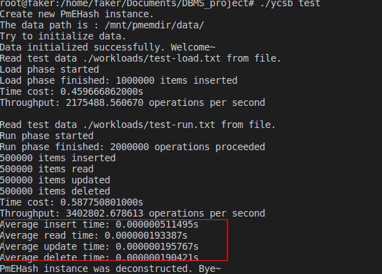

# 2020-DBMS-project

**小组成员**

| 学号 | 姓名 |
| :-------:| :---:|
| 18308008 | 车春江|
| 18353070 | 谭嘉伟|
| 17364025 | 贺恩泽|
| 18324061 | 文君逸|

## 项目内容

&emsp;&emsp;实验项目完成的目标是完成基于针对NVM优化的可扩展哈希的数据结构，实现一个简单的键值存储引擎PmEHash。我们用data_page来实现数据页表的相关操作实现。    

&emsp;&emsp;此项目对外可用的对数据的基本操作如下：

+ **Insert(插入数据)**
+ **Remove(删除数据)**
+ **Update(更新数据)**
+ **Search(查找数据)**
+ **删除所有数据**
+ **重启恢复状态**
  

&emsp;&emsp;我们在数据库课程的学习中认识到，DBMS是一种操纵和管理数据的大型软件。可靠的DBMS应该向用户屏蔽具体数据操作实现细节，并且保证执行事务的原子性、一致性、隔离性、持久性。一般DBMS将大量数据存储在非易失性存储器中，在查询和更新时才将一些数据读入内存缓冲区处理。DBMS需要在数据更新时立即将数据写回非易失性存储器，否则在程序运行崩溃或计算机断电的情况下可能会因为修改的内容没有写回非易失性存储器而丢失，造成数据不一致性与非持久性。

&emsp;&emsp;在本项目中，CPU与NVM交互的方式与内存交互类似。CPU修改NVM中的数据时，也会先在Cache中修改缓存了的数据，DBMS需要将修改及时持久化到NVM中。本项目基于DBMS的上述理念，在每一次数据更新后都立刻将数据持久化写回NVM，以保证实现的整个kv键值对数据库的一致性与持久性。  

&emsp;&emsp;此项目需要完成的任务有：

+ **用内存模拟NVM**
+ **实现代码框架的功能**
+ **进行简单的Google test，运行并通过ehash_test.cpp中的简单测试**
+ **编写main函数进行YCSB benchmark测试，读取workload中的数据文件进行增删改查操作，测试运行时间并截图性能结果。**

## 项目实现方法

&emsp;&emsp;以下我们采用自顶向下的介绍方法，先介绍上层函数是怎么实现的，调用了哪些底层函数，然后再介绍底层函数的实现方法。上层操作指的是kv键值对数据库给外界调用的接口函数(也就是成员函数访问控制为public的几个函数)。底层函数则是实现可扩展hash分裂桶、合并桶等对外界不可见的函数。(也就是成员函数访问控制为private的几个函数)

### Search(查找数据) 和 Update(更新数据)

&emsp;&emsp;查找数据、更新数据是比较简单的操作，只需要根据函数传入的键值，利用自己设计的哈希函数计算出对应的**bucket_id**,再通过**catalog**中的信息得到**bucket_id**对应的桶的虚拟地址，然后遍历这个桶里面所有的**kv**对就可以找到了。不同之处是**Update**找到后需要修改存储的**value**, 并立即进行持久化操作，更新函数实现过程如下：

``` C++
/**
 * @description: 查找目标键值对数据，将返回值放在参数里的引用类型进行返回
 * @param uint64_t: 查询的目标键
 * @param uint64_t&: 查询成功后返回的目标值
 * @return: 0 = search successfully, -1 = fail to search(target data doesn't exist) 
 */
int PmEHash::search(uint64_t key, uint64_t& return_val) {
    int bucketid = hashFunc(key);//先找到这个key所在的桶的地址，然后遍历桶所有的kv对
       
    pm_bucket* tar_bucket = catalog->buckets_virtual_address[bucketid];//取出key对应的桶的虚拟地址

    for (int i = 0; i < BUCKET_SLOT_NUM; i++) {//遍历所有槽位
        if (tar_bucket->bitmap[i] && tar_bucket->slot[i].key == key) {//当前槽位存在键值对 且key与需要检索的key相同
            return_val = tar_bucket->slot[i].value;//取得value值
            return 0;
        }
    }
    
    return -1;
}
/**
 * @description: 更新现存的键值对的值
 * @param kv: 更新的键值对，有原键和新值
 * @return: 0 = update successfully, -1 = fail to update(target data doesn't exist)
 */
int PmEHash::update(kv kv_pair) {
    int bucketid = hashFunc(kv_pair.key);//先找到这个key所在的桶的地址，然后遍历桶所有的kv对
            
    pm_bucket* tar_bucket = catalog->buckets_virtual_address[bucketid];//取出key对应的桶的虚拟地址

    for (int i = 0; i < BUCKET_SLOT_NUM; i++) {//遍历所有槽位
        if (tar_bucket->bitmap[i] && tar_bucket->slot[i].key == kv_pair.key) {//当前槽位存在键值对 且key与需要更新的kv对的key相同
            tar_bucket->slot[i].value=kv_pair.value;//修改
            //修改后需要立即持久化
            pmem_persist(&(tar_bucket->slot[i].value), sizeof(tar_bucket->slot[i].value));//只需持久化value而不用持久化整个桶 保障运行性能
            return 0;
        }
    }
    
    return -1;
}
```

### Insert(插入数据)

&emsp;&emsp;插入数据的过程包含了查找数据的过程。如果查找到了一个相同键值的数据已经被插入，那么该键值的数据是不允许再次被插入的。而如果在对应的桶中没有找到相同键值的数据，那么就可以开始进行插入过程。一个比较简单的插入过程就是通过调用 **getFreeBucket()** 和调用 **getFreeKvSlot()** 得到插入的地址，将相应的 **bitmap** 位置1即可。但后面我们可以看到，在找到可以插入的地址时并不那么简单，因为一个满的桶可能导致桶的分裂和目录的倍增，也可能导致新的一个页面的分配。但由于是介绍 **insert()** 函数，所以我们暂时不考虑这些。同样插入需要持久化操作，函数实现过程如下：

``` C++
/**
 * @description: 插入新的键值对，并将相应位置上的位图置1
 * @param kv: 插入的键值对
 * @return: 0 = insert successfully, -1 = fail to insert(target data with same key exist)
 */
int PmEHash::insert(kv new_kv_pair) {
    uint64_t result;
    if (search(new_kv_pair.key, result) == 0) {//存在相同的key 插入失败
        return -1;
    }

    pm_bucket* new_bucket = getFreeBucket(new_kv_pair.key);//获得一个有空闲槽位的桶来插入
    assert(new_bucket != NULL);

    kv* tar_kv = getFreeKvSlot(new_bucket);//占用一个空闲槽位并获得该槽位的地址
    assert(tar_kv != NULL);

    tar_kv->key = new_kv_pair.key;//插入
    tar_kv->value = new_kv_pair.value;
    //修改后需要持久化键值对
    pmem_persist(tar_kv, sizeof(kv));
    return 0;
}
```

### Remove(删除数据)

&emsp;&emsp;删除数据的过程也包含了查找数据的过程，这里不再赘述。同样，删除操作只需要把对应的**bitmap**位置0即可，并需要响应的持久化操作。但是删除数据可能导致一个桶变空，因此需要释放桶的空间，这一操作在后面的函数中会详细说明。删除数据的实现如下：

``` C++
/**
 * @description: 删除具有目标键的键值对数据，不直接将数据置0，而是将相应位图置0即可
 * @param uint64_t: 要删除的目标键值对的键
 * @return: 0 = removing successfully, -1 = fail to remove(target data doesn't exist)
 */
int PmEHash::remove(uint64_t key) {
    int bucketid = hashFunc(key);//先找到这个key所在的桶的地址，然后遍历桶所有的kv对
             
    pm_bucket* tar_bucket=catalog->buckets_virtual_address[bucketid];//获得桶的虚拟地址

    bool succ=0;
    for (int i = 0; i < BUCKET_SLOT_NUM; i++) {//遍历所有槽位
        if (tar_bucket->bitmap[i] && tar_bucket->slot[i].key == key) {//当前槽位有kv对 且kv对的key与希望删除的key相同
            tar_bucket->bitmap[i]=0;//删除
            //修改后需要持久化
            pmem_persist(tar_bucket->bitmap, sizeof(tar_bucket->bitmap));//只需要持久化bitmap而不需要持久化整个桶 保障程序运行性能
            succ=1;//删除成功
            break;
        }
    }   

    if (isBucketFull(bucketid)) mergeBucket(bucketid);//桶空了后 看是否需要合并桶 回收空间

    if (succ) return 0;else return -1;
}
```

### 哈希函数

&emsp;&emsp;讨论完了上面的上层接口，现在来讨论一下底层的哈希函数。哈希函数的设计对于哈希表来说非常重要，对可扩展哈希也是如此。如果可扩展哈希的哈希函数选择的不好，那么正如助教师兄提供的课本所说，在一定的偏斜的数据输入的情况下，会导致哈希表运行效率恶化，甚至导致程序崩溃。具体来说，假设我们设计的`BUCKET_SLOT_NUM`是默认的15，而`global_depth`初始为4，我们的hash函数设计为直接取key二进制的最低`global_depth`位，我们考虑用户以下情况的输入。

&emsp;&emsp;假设数据初始为空，用户接着连续插入16个kv对：用户输入的key最低60位都为0，只有最高4位从0000取到1111各不相同(共16个不同的key)。这16个key显然都会被分到相同的0号桶。插入前15个kv对之后，由于`BUCKET_SLOT_NUM`刚好为15，那么此时0号桶容纳的下15个kv对，不会发生问题。接着插入第16个kv对，这个kv对会被分到0号桶，可是0号桶已经容纳不下了，也就会触发0号桶的分裂。

&emsp;&emsp;0号桶分裂1次，局部深度就会增加1。局部深度超过全局深度后，会导致全局深度也增加1，进而触发目录倍增。由于hash函数设计地比较简单，直接取key二进制的最低`global_depth`位作为桶号。0号桶需要持续地分裂，直到0号桶存在两个key二进制从低到高第`local_depth`位不同，才能将0号桶内之前的元素分到两个桶中，也才有新的槽位给第16个kv对插入。

&emsp;&emsp;然而，这16个kv对的二进制最低60位都完全相同。那么`local_depth`要增加到61，才能将0号桶中的元素分到两个桶中。由于`global_depth`大于等于所有`local_depth`，此时会导致`global_depth`也增加到61。那么也就意味着，目录项要倍增到$2^{61}$项。目录项中一个`pm_address`信息就需要8字节的空间才能记录(还未考虑`pm_bucket`的空间)。那么单是`pm_address`，就需要总共$2^{64} Byte$的空间。换算一下就是需要$2^{24} TB$(33,554,432‬ TB)。这个数字显然是个天文数字，远远超过了内存和磁盘能容纳的空间大小。程序还未运行到这个时候就会立即崩溃。

&emsp;&emsp;因此，如果哈希函数设计得不好，仅仅插入16个kv对，就可以让可扩展哈希完全崩溃。

&emsp;&emsp;为了克服上面所说的困难，我们对于给定的key，先将这个key进行一些比较复杂的取模、移位、异或的处理(根据相关组合数学与数论知识，对大质数取模效果更好)。使得对于用户输入的key，可以通过hash函数比较均匀地映射到另一个64位无符号整数空间
。我们再将新得到的无符号整数取二进制最低`global_depth`位得到桶号。之所以取二进制低位，是因为这个操作可以很方便地通过速度较快的位运算&(catalog_size-1)得到。(同时，取二进制低位也使得目录倍增更为方便，详见对目录倍增的分析)

``` C++
/**
 * @description: 用于对输入的键产生哈希值，然后取模求桶号(自己挑选合适的哈希函数处理)
 * @param uint64_t: 输入的键
 * @return: 返回键所属的桶在目录中的编号
 */
int PmEHash::hashFunc(uint64_t key) {
    
    key=(((key<<44)|(key>>20))%998244353+key)^((key<<24)|(key>>40))^(((key<<32)|(key>>32))%1000000009);//足够复杂的hash函数使得偏斜的key输入映射得到的hash函数值更均匀
    //hash函数设计不当会导致偏斜数据输入导致全局深度迅速增加 使得内存完全被占用导致程序崩溃

    return key&(metadata->catalog_size-1);//返回桶号    
}
``` 

### 插入时获得有空闲槽位的桶

```C++
/**
 * @description: 获得供插入的空闲的桶，无空闲桶则先分裂桶然后再返回空闲的桶(可能会触发连续分裂)
 * @param uint64_t: 带插入的键
 * @return: 空闲桶的虚拟地址
 */
pm_bucket* PmEHash::getFreeBucket(uint64_t key) {

    while (1){//对连续分裂的处理
        int bucketid = hashFunc(key);
        pm_bucket* insert_bucket=catalog->buckets_virtual_address[bucketid];//获得虚拟地址
       
        if (haveFreeKvSlot(insert_bucket))//直到对当前插入的元素分到的桶有空闲槽位时返回
            return insert_bucket;

        splitBucket(bucketid);//否则连续分裂桶
    }
}

/**
 * @description: 判断桶内是否存在空闲位置
 * @param: pm_bucket* bucket
 * @return bool: 存在/不存在空闲KvSlot 
 */
bool PmEHash::haveFreeKvSlot(pm_bucket* bucket) {
    for (int i = 0; i < BUCKET_SLOT_NUM; i++) {//遍历所有槽位
        if (bucket->bitmap[i] == 0) return true;//存在空闲槽位
    }

    return false;
}
```

### 分裂桶与目录倍增的处理

&emsp;&emsp;一个桶在被判断满后需要分裂，我们自然要先得到是哪个桶需要分裂，也就是要得到要分裂的桶的虚拟地址。一个桶分裂后，其对应的局部深度要加一，即这个桶代表的二进制位需要多判断一位。这这之前，如果全局深度和目前要分裂的这个桶的局部深部深度相等的话，那么要先增加全局深度，再来增加这个桶的局部深度。否则目录不足以记录新分裂的桶对应的二进制模式。    

&emsp;&emsp;分裂一个桶无非是要用一个新的二进制位的0和1来区分原来的局部深度所不足以区分的键值。所以分裂过程中我们只需要将待分裂的桶的新的这一个二进制位所能区分的数据分装到分裂后的两个桶里即可。区分的过程采用位运算即可。     

&emsp;&emsp;上面原理性的操作结束后，剩下的便是一些细节性的操作。处理好目录指向新、旧桶的指针，释放旧目录所占的空间，并进行持久化操作即可。两个函数的代码实现如下：    

``` C++

/**
 * @description: 桶满后进行分裂操作，可能触发目录的倍增
 * @param uint64_t: 目标桶在目录中的序号
 * @return: 无返回值
 */
void PmEHash::splitBucket(uint64_t bucket_id) {

    pm_bucket* sp_Bucket=catalog->buckets_virtual_address[bucket_id];//得到被分裂的桶虚拟地址

    if (sp_Bucket->local_depth==metadata->global_depth) extendCatalog();//局部深度等于全局深度 需要倍增目录

    pm_address new_address;
    pm_bucket* new_Bucket=(pm_bucket*)getFreeSlot(new_address);//得到新的桶虚拟地址(需要初始化)

    int old_local_depth=sp_Bucket->local_depth;
    new_Bucket->local_depth=++sp_Bucket->local_depth;//更新桶的深度
   
    int cur=0;
    for(int i=0;i<BUCKET_SLOT_NUM;i++) if (hashFunc(sp_Bucket->slot[i].key)&(1<<old_local_depth)){
        sp_Bucket->bitmap[i]=0;
        new_Bucket->bitmap[cur]=1;
        new_Bucket->slot[cur].key=sp_Bucket->slot[i].key;
        new_Bucket->slot[cur].value=sp_Bucket->slot[i].value;
        cur++;
    }

    //!!!需要持久化sp_Bucket和new_Bucket
    pmem_persist(sp_Bucket, sizeof(pm_bucket));
    pmem_persist(new_Bucket, sizeof(pm_bucket));

    for(int i=(bucket_id&((1<<old_local_depth)-1))|(1<<old_local_depth);i<(1<<metadata->global_depth);i+=(1<<(old_local_depth+1))){//更新目录项，一半指向旧桶的目录项指向新桶
        catalog->buckets_pm_address[i]= new_address;
        catalog->buckets_virtual_address[i]=new_Bucket;
    }
    
    //!!!需要持久化目录
    pmem_persist(catalog->buckets_pm_address, sizeof(pm_address)*metadata->catalog_size);
    pmem_persist(catalog->buckets_virtual_address, sizeof(pm_bucket*)*metadata->catalog_size);
}

/**
 * @description: 对目录进行倍增，需要重新生成新的目录文件并复制旧值，然后删除旧的目录文件
 * @param NULL
 * @return: NULL
 */
void PmEHash::extendCatalog() {
    // * new_page = (data_page*)pmem_map_file((PERSIST_PATH+to_string(id)).c_str(), sizeof(data_page), PMEM_FILE_CREATE, 0666, &map_len, &is_pmem);
    // pm_address* old_pm_address = catalog->buckets_pm_address;
    // pm_bucket** old_virtual_address = catalog->buckets_virtual_address;

    pm_address* old_pm_address=new pm_address[1<<metadata->global_depth];
    pm_bucket** old_pm_bucket=new pm_bucket*[1<<metadata->global_depth];
    for(int i=0;i<(1<<metadata->global_depth);i++){
        old_pm_address[i]=catalog->buckets_pm_address[i];
        old_pm_bucket[i]=catalog->buckets_virtual_address[i];
    }

    metadata->global_depth++;
    metadata->catalog_size *= 2;

    std::string name = Env::get_path() + std::string("pm_address");
    int is_pmem;
    size_t pm_address_len;
    catalog->buckets_pm_address = (pm_address*)pmem_map_file(name.c_str(), sizeof(pm_address)<<metadata->global_depth, PMEM_FILE_CREATE, 0666, &pm_address_len, &is_pmem);
    
    size_t virtual_address_len;
    name = Env::get_path() + std::string("pm_bucket");
    catalog->buckets_virtual_address = (pm_bucket**)pmem_map_file(name.c_str(), sizeof(pm_bucket*)<<metadata->global_depth, PMEM_FILE_CREATE, 0666, &virtual_address_len, &is_pmem);

    for(int i=0;i<(1<<(metadata->global_depth-1));i++){
        catalog->buckets_pm_address[i]=old_pm_address[i];
        catalog->buckets_virtual_address[i]=old_pm_bucket[i];
        catalog->buckets_pm_address[i|(1<<(metadata->global_depth-1))]=old_pm_address[i];
        catalog->buckets_virtual_address[i|(1<<(metadata->global_depth-1))]=old_pm_bucket[i];     
    }    

    delete [] old_pm_address;
    delete [] old_pm_bucket;

    //!!!需要持久化目录        
    pmem_persist(catalog->buckets_pm_address, sizeof(pm_address)*metadata->catalog_size);
    pmem_persist(catalog->buckets_virtual_address, sizeof(pm_bucket*)*metadata->catalog_size);

}
```

### 桶空后的空间回收

### 定长页表的设计

&emsp;&emsp;定长页表的头文件设计如下：

``` C++
struct data_page{
    // fixed-size record design
    // uncompressed page format
    //一个数据页面要定义页面号， 记录哪些桶可以用，哪些桶不能用的位图，以及存放数据的桶
    //和TA示意图是一样的
    pm_bucket buckets[DATA_PAGE_SLOT_NUM];
    bool bit_map[DATA_PAGE_SLOT_NUM];
    uint32_t page_id;

    data_page(){
        memset(bit_map, 0, sizeof(bit_map));
    }
};
```
&emsp;&emsp;在初始化的过程只要将所有的桶记为可用即可。

### 分配新的一页

&emsp;&emsp;实现这个功能所用的函数为**allocNewPage()**，首先需要在持久化内存上建立新的一页，也就是建立新的文件，然后需要将新建的一页的每一个桶都记为可用，并建立持久内存和虚拟内存之间的对应联系，并将**catalog**的**max_file_id**加1即可。实现代码如下：

``` C++
/**
 * @description: 申请新的数据页文件，并把所有新产生的空闲槽的地址放入free_list等数据结构中
 * @param NULL
 * @return: NULL
 */
void PmEHash::allocNewPage() {
    metadata->max_file_id++;
    data_page* new_page=create_new_page(metadata->max_file_id);
    pm_address new_address;
    new_address.fileId = metadata->max_file_id;
    for(int i = 0;i < DATA_PAGE_SLOT_NUM;i++){
        free_list.push(&new_page->buckets[i]);
        new_address.offset = i*sizeof(pm_bucket);
        vAddr2pmAddr[&new_page->buckets[i]] = new_address;
        pmAddr2vAddr[new_address] = &new_page->buckets[i];
        data_page_list.push_back(new_page);
    }
}
```

### 修改NVM的操作

&emsp;&emsp;修改持久化内存主要用到以下三个函数：
+ **void pmem_persist(const void \*addr, size_t len)**
+ **void \*pmem_map_file(const char \*path, size_t len, int flags,mode_t mode, size_t \*mapped_lenp, int \*is_pmemp)**
+ **int pmem_unmap(void \*addr, size_t len)**

&emsp;&emsp;其中第一个函数是将在缓存(虚拟地址)中的修改记录到持久内存中去，第二个函数是用于创建或打开文件并将其映射到内存，第三个函数用于取消映射指定的区域。这三个函数是库函数，已经为我们提供了接口，所以只需要在内存持久化的过程中调用就可以了。在上面的代码中我们也可以看到在持久化内存的时候这三个函数频繁被调用。

### 重新启动时恢复映射状态

&emsp;&emsp;完成这个过程所采用的主要函数是**mapAllPage()**。主要思路如下：

#### 重新读入metadata的信息

&emsp;&emsp;进行这一步的目的是为了读出目录的大小，记录关键的信息，例如**catalog_size**, **max_file_id**, 以便于后面初始化**catalog**信息的时候分配对应大小的空间。只有在初始化完指针的空间之后才能进行下一步的操作，否则会报**segmentation fault**(段错误)。

#### 读取每一个页面的信息

&emsp;&emsp;由于本项目在持久化文件时已经将**page_id**作为文件名，所以只要用一个变量**i**从1到**max_file_id**循环即可。在读入的时候需要读入页面、桶的空闲与占用信息，建立持久内存地址和虚拟地址的映射关系。最后再初始化**PmEHash**类的**catalog**的信息即可。    
&emsp;&emsp;在这个函数写好后，**recover()** 方法只需要调用这个函数就可以了。此函数的实现如下：

``` C++
/**
 * @description: 重启时，将所有数据页进行内存映射，设置地址间的映射关系，空闲的和使用的槽位都需要设置 
 * @param NULL
 * @return: NULL
 */
void PmEHash::mapAllPage() {
    //读入pm_address和pm_bucket两个文件，并将映射的指针赋值给catalog
    //读入metadata
    std::string name = Env::get_path() + std::string("metadata");
    size_t metadata_len;
    int is_pmem;
    metadata = (ehash_metadata*)pmem_map_file(name.c_str(), sizeof(ehash_metadata), PMEM_FILE_CREATE, 0666, &metadata_len, &is_pmem);

    pm_address* buckets_address = new pm_address[metadata->catalog_size];
    pm_bucket** virtual_address = new  pm_bucket*[metadata->catalog_size];

    uint64_t page_num = metadata->max_file_id;
    for(int i = 1;i <= page_num;i++){
       name = Env::get_path() + std::to_string(i);
        size_t map_len;
        data_page* old_page = (data_page*)pmem_map_file(name.c_str(), sizeof(data_page), PMEM_FILE_CREATE, 0666, &map_len, &is_pmem);
        data_page_list.push_back(old_page);
        for(int j = 0;j < DATA_PAGE_SLOT_NUM;j++){
            if(!old_page->bit_map[j]){
                free_list.push(&old_page->buckets[j]);
            }
            buckets_address[(i-1)*DATA_PAGE_SLOT_NUM+j].fileId = i;
            buckets_address[(i-1)*DATA_PAGE_SLOT_NUM+j].offset = j*sizeof(pm_bucket);
            virtual_address[(i-1)*DATA_PAGE_SLOT_NUM+j] = &old_page->buckets[j];
            vAddr2pmAddr[virtual_address[(i-1)*DATA_PAGE_SLOT_NUM+j]] = buckets_address[(i-1)*DATA_PAGE_SLOT_NUM+j];
            pmAddr2vAddr[buckets_address[(i-1)*DATA_PAGE_SLOT_NUM+j]] = virtual_address[(i-1)*DATA_PAGE_SLOT_NUM+j];
        }
    }

    catalog = new ehash_catalog;
    catalog->buckets_pm_address = buckets_address;
    catalog->buckets_virtual_address = virtual_address;

}

```


## gtest结果


如上图所示，设计的可扩展hash通过了gtest测试。

不过gtest测试数据比较简单，不会触发分裂、合并桶、倍增目录等函数。可以进一步用下面的ycsb和CLDB进行测试，验证可扩展哈希的正确性。

## ycsb结果

我们使用workloads文件夹下给定的所有数据和多组随机数据进行了测试。下面的截图为有代表性的几种情况。

### 测试220w-rw-50-50极限数据


可以看到不到3秒的时间即可完成该数据集

### 测试220w-rw-50-50极限数据时，使用map对比结果验证正确性


可以看到和map运行结果完全一致，验证了可扩展哈希在该数据集下的正确性。

### 随机测试(数据生成器参数test 1000000 2000000 2147483647)



在上图中我们以load阶段100万次初始读入，run阶段200万次随机操作，key数值范围为0~2147483647进行测试。其中在Run环节增删查改的比例是相同的。程序计算出了每种操作的平均用时。可以看到插入的平均时间最长，且明显大于其他三种操作。其次是更新的时间较长，而删除和查找时间比较接近。

## ycsb结果分析

&emsp;&emsp;从理论上粗略对可扩展哈希的每种操作进行复杂度分析的话，那么插入的时间应该大于其他操作的时间，其次是删除和更新，最快的是查询操作。对于以上情况的出现，我们分析一下四种操作执行了哪些步骤，时间复杂度是怎样的。

### Insert(插入数据)

&emsp;&emsp;在插入数据的时候，首先我们调用了**search**函数来查看一个键值是否存在，也就是说插入数据的过程包含了查找数据的过程。另外，当插入数据时还有几种特殊情况需要考虑   

+ 插入数据的哈希值对应的页号不存在时，需要分配新的一页，花费时间为 ___O(data_page_slot_num)___  
+ 当一个桶满的时候，将进行对桶的分裂，同时还有可能触发目录的倍增。分裂桶需要先遍历桶中的元素，将部分元素复制到另外一个桶中，之后需要将目录中的部分项给修改，最坏情况下需要将接近整个目录大小的目录项进行修改。因此分裂桶的时间复杂度为 ___O(bucket_slot_num + catalog_length)___ 。而如果触发了倍增目录，则需要将旧目录复制一倍接到目录后面，并让全局深度增加1，这部分时间复杂度为 ___O(catalog_length)___ 。值得注意的是**catalog_length**和全局深度**global_depth**是成指数关系的，当全局深度很大时，整个目录长度可能很大，遍历的时间开销很高。

### Search(查找数据)

&emsp;&emsp;查询时可以直接由哈希值定位到桶的虚拟地址，因此只需要对整个桶所有的槽进行遍历即可，因此时间复杂度为 ___O(bucket_slot_num)___ 。

### Remove(删除数据)

&emsp;&emsp;删的过程需要先找到这个数据，也就是包含了查找的过程。但是由于删除数据之后，一个桶可能变为空桶，因此要合并桶和回收这个桶的空间，合并桶的时间复杂度为 ___O(catalog_length)___ (因为也需要修改目录中的相关项指向合并后的桶，最坏情况下也要修改接近整个目录大小的目录项)。

### Update(更新数据)

&emsp;&emsp;更新数据的过程和查找数据的过程时间复杂度是一样的，只需要在找到数据之后进行一次修改操作就可以了。但由于更新数据也需要将一些数据持久化写回NVM，所以所需的时间会比单纯查找要慢一些。

### 总体分析

&emsp;&emsp;综上来看，插入操作所花费的时间是最长的，删除和更新操作的时间较短，查找操作的时间最短，这个结论与截图中的结果是一致的。

## 命令行数据库(CLDB)

我们编写了一个命令行下的数据库，可以调用可扩展哈希的接口函数。可以通过命令行操作该程序，可以验证可扩展哈希插入、删除、更新、搜索、清空等函数，持久化保存与重新读取等功能的正确性。


可以从上面的截图中看出，命令行数据库功能正常，符合要求。

## 多线程实现实验
我们尝试了利用多线程实现数据的持久化，由于每次操作后均需要持久化数据，该操作可能会造成较大消耗，因此我们尝试多线程方案。

对于多线程方案，我们采取后台线程队列方式进行数据的持久化，当需要进行数据持久化时，向队列中投递任务，由另一个线程消费持久化队列进行处理。

``` C++
std::queue<std::pair<void*, uint64_t>> PersistWorker::queue = std::queue<std::pair<void*, uint64_t>>();

void PersistWorker::worker(volatile bool* exited) {	
    while (exited == nullptr || !(*exited)) {	
        sem_wait(Env::get_semaphore());	
        if (!queue.empty()) {	
            auto& data = queue.front();	
            pmem_persist(data.first, data.second);
            queue.pop();
        } else {	
            sem_post(Env::get_semaphore_sync());	
        }	
    }	
    sem_post(Env::get_semaphore_sync());	
}
```

当需要持久化时，向队列中投递任务后释放信号量：
``` C++
queue.push(std::make_pair(address, size));	
sem_post(Env::get_semaphore());
```

但是这样造成了一些问题：当需要释放数据进行 unmap 时，若后台持久化队列还没有完成时，可能会造成对已经释放的无效数据进行持久化导致段错误。

因此，需要一个同步信号量，用于等待持久化队列消费完成后再进行销毁操作。

``` C++
sem_wait(Env::get_semaphore_sync());

delete[] catalog->buckets_virtual_address;
delete[] catalog->buckets_virtual_address;  
......
```

最后的测试结果如下：

多线程模式：


单线程模式：


可以看到多线程反而降低了吞吐量。

分析原因可以得出，频繁的信号量操作反而带来了更大的开销，以及线程之间的数据同步造成了更多的阻塞开销，因此最后仍然采用原有的单线程实现方案。